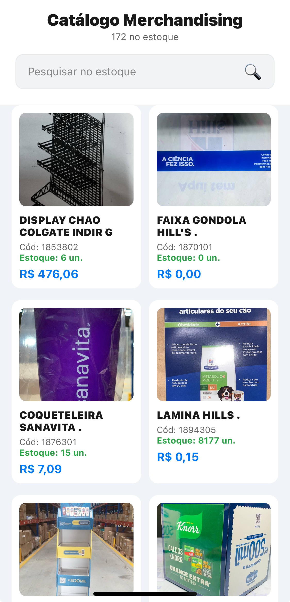
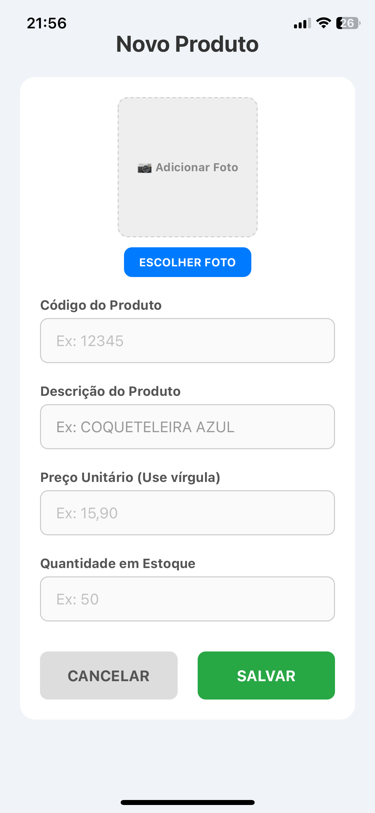

# MerchApp - Sistema de Gestão de Merchandising

**Projeto de Extensão Universitária - Ciência da Computação** **Desenvolvedor:** Jackson Bruno Costa  
**Data:** 22 de Fevereiro de 2026

## O Problema (Contexto Real)
A equipe de merchandising da distribuidora gere centenas de produtos promocionais (brindes e materiais de marketing). O fluxo de pedidos era prejudicado porque as informações (nomes, códigos e fotos) estavam dispersas em planilhas de Excel e pastas do Google Drive, dificultando a consulta rápida via smartphone pelos gerentes de lojas e intermediários no dia a dia.

## Solução Técnica
O MerchApp centraliza todo o catálogo de merchandising em uma aplicação mobile leve, rápida e intuitiva, permitindo a consulta de estoque e visualização de itens em tempo real. A arquitetura foi desenvolvida para garantir alta disponibilidade e baixo consumo de dados móveis.

### Tecnologias Utilizadas:
* **React Native & Expo**: Framework principal para o desenvolvimento do frontend mobile.
* **Context API**: Gestão de estado global para controle de autenticação e níveis de acesso.
* **PHP & MySQL (Hostinger)**: Desenvolvimento de uma API RESTful para realizar o CRUD e persistência de dados em um banco de dados relacional em nuvem.
* **Expo Image Manipulator**: Biblioteca para processamento e compressão de imagens nativamente no dispositivo (client-side) antes do envio ao servidor.
* **EAS Build**: Ferramenta utilizada para a integração contínua e geração do artefato final (.APK).

### Demonstração do Sistema

| Tela de Login | Catálogo de Merchandising | Painel de Gestão (Admin) |
| :---: | :---: | :---: |
|  |  |  |

## O Desafio da Otimização (Diferencial Técnico)
Um dos maiores desafios técnicos deste projeto foi a gestão do tráfego de mídias. O upload de fotografias em resolução original (que atualmente variam entre 5MB e 10MB em smartphones modernos) sobrecarregaria a largura de banda do usuário e o armazenamento do servidor de hospedagem.

* **Solução:** Implementação de um pipeline de compressão nativa no dispositivo do usuário antes do envio da requisição (payload). Utilizando a biblioteca `expo-image-manipulator`, as imagens capturadas ou selecionadas da galeria são interceptadas.
* **Resultado:** As fotos são automaticamente redimensionadas e comprimidas para o formato JPEG (70% de qualidade). Isso reduziu o tamanho médio dos arquivos enviados via `multipart/form-data` para cerca de 100KB, resultando em uma otimização de tráfego de rede superior a 90% e garantindo uploads quase instantâneos, mesmo em conexões 3G.

## Funcionalidades
* **Autenticação e Níveis de Acesso (RBAC)**: 
    * **Admin**: Permissão total para adicionar novos brindes, atualizar informações de estoque, alterar fotografias e excluir produtos do banco de dados (CRUD completo).
    * **Usuário**: Acesso restrito em modo de leitura (Read-Only) para consulta do catálogo e pesquisa de disponibilidade.
* **Busca Dinâmica**: Filtro de pesquisa no lado do cliente e do servidor (via API) para localização de itens por código ou descrição, com resposta em tempo real.
* **Gestão de Imagens Integrada**: Interface unificada para upload e substituição de materiais promocionais utilizando a câmera do dispositivo ou a galeria local.

## Como Testar
1. Faça o download do aplicativo através deste **[Link Oficial de Build (Expo EAS)](https://expo.dev/accounts/jacksonbbcosta/projects/merchAPP/builds/c1ab2257-b098-439b-934f-9d25d50a3848)**.
2. Na página do Expo, clique em "Download" para baixar o arquivo `.apk`.
3. Instale em um dispositivo Android físico ou emulador (ex: BlueStacks ou Android Studio).
4. **Credenciais de Teste:**
   - **Administrador**: login `admin` | senha `admin`
   - **Usuário Padrão**: login `user` | senha `user`

---

## Metodologia e Arquitetura Atual
O projeto foi desenvolvido seguindo a metodologia de Prototipagem Ágil. O sistema evoluiu de um MVP local para uma aplicação plenamente funcional conectada à nuvem. Atualmente, o frontend (Mobile) opera de forma totalmente desacoplada do backend, comunicando-se exclusivamente via requisições HTTP (Fetch API) com os scripts PHP hospedados, garantindo escalabilidade e segurança na manipulação das regras de negócio.

---
**Jackson Bruno Costa** | [GitHub Profile](https://github.com/jacksonbbcosta) | jacksonbragacosta@gmail.com
