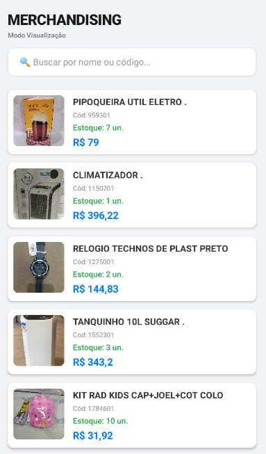

# 📦 MerchApp - Sistema de Gestão de Merchandising

**Projeto de Extensão Universitária - Ciência da Computação** **Desenvolvedor:** Jackson Bruno Costa  
**Data:** 21 de Fevereiro de 2026

## 🚀 O Problema (Contexto Real)
A equipe de merchandising da distribuidora gere centenas de produtos promocionais (brindes e materiais de marketing). O fluxo de pedidos era prejudicado porque as informações (nomes, códigos e fotos) estavam dispersas em **planilhas de Excel e pastas do Google Drive**, dificultando a consulta rápida via smartphone pelos gerentes de lojas e intermediários no dia a dia.

## 🛠️ Solução Técnica
O **merchAPP** centraliza todo o catálogo de merchandising numa aplicação mobile leve, rápida e intuitiva, permitindo a consulta de stock e visualização de itens em tempo real.

### Tecnologias Utilizadas:
* **React Native & Expo**: Framework principal para o desenvolvimento mobile.
* **Context API**: Gestão de estado global para sincronização de dados entre as telas.
* **Node.js & Sharp**: Script de automação para compressão de assets (imagens).
* **EAS Build**: Ferramenta utilizada para gerar o artefacto final (.APK).

### 📸 Demonstração do Sistema (Prints)

| Tela de Login | Catálogo de Merchandising | Painel de Gestão (Admin) |
| :---: | :---: | :---: |
|  |  |  |

## ⚙️ O Desafio da Otimização (Diferencial Técnico)
Um dos maiores diferenciais deste projeto foi a gestão de média. Com mais de **200 fotos de alta resolução**, o build inicial atingiu **255 MB**, o que inviabilizava o uso em dispositivos com pouco armazenamento.
* **Solução:** Implementação de um script customizado utilizando a biblioteca `sharp`.
* **Resultado:** Redução do tamanho final do APK para **38.1 MB** (uma otimização de aproximadamente 85%), mantendo a qualidade visual necessária para a identificação dos produtos.

## 📱 Funcionalidades
* **Níveis de Acesso (RBAC)**: 
    * **Admin**: Permissão total para adicionar novos brindes, editar stock e eliminar produtos.
    * **User**: Acesso restrito apenas para consulta e visualização das fotos do catálogo.
* **Busca Dinâmica**: Filtro por nome ou código do produto com resposta instantânea.
* **Galeria Integrada**: Permite registar novos materiais promocionais usando a câmara do telemóvel.

## 📂 Como Testar
1. Descarregue o ficheiro `merchapp.apk`.
2. Instale num dispositivo Android ou emulador (ex: **BlueStacks 5**).
3. **Credenciais de Teste:**
   - **Admin**: login `admin` | senha `admin`
   - **Usuário**: login `user` | senha `123`

---

## 📈 Metodologia e Evolução
O projeto foi desenvolvido seguindo a metodologia de **Prototipagem Ágil**. Nesta fase de MVP, os dados são geridos localmente para garantir o funcionamento em ambientes de stock com baixa conectividade. A arquitetura foi desenhada de forma modular, permitindo a futura migração para um banco de dados em nuvem (**Firebase**) sem necessidade de refatoração da interface.

---
**Jackson Bruno Costa** [GitHub Profile](https://github.com/jacksonbbcosta)
